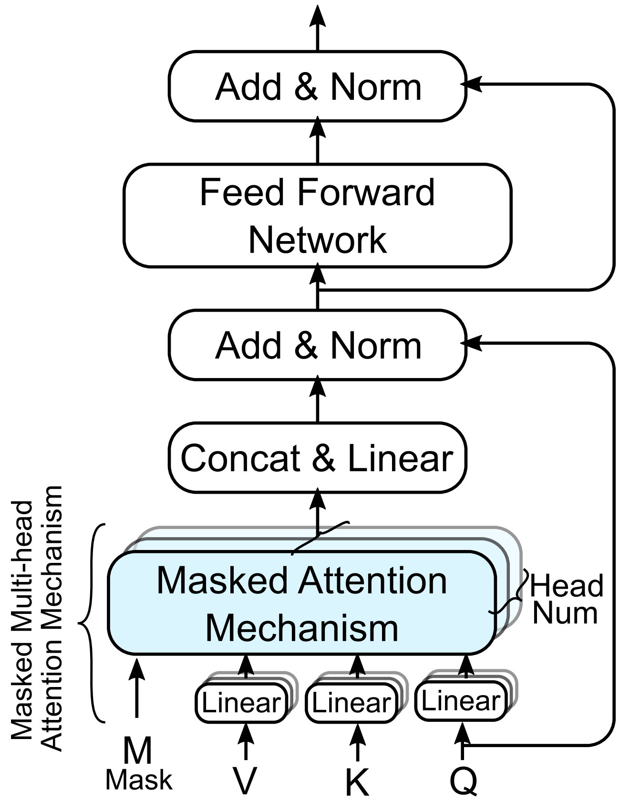

# Reproducibility of [BiteNet](https://arxiv.org/pdf/2009.13252.pdf)

##  Environment and Dependencies
|Package|Version|
|:---|:---|
|||
|pandas|1.3.5
|pandas-datareader|0.9.0
|sklearn|0.0
|sklearn-pandas|1.8.0
|numpy|1.21.6
|keras|2.8.0
|matplotlib|3.2.2
|scipy|1.4.1

To install all requirements:
```bash
pip install -r requirements.txt
```


## Framework:  
 


## Data Preparation
Put everything necessary `.csv` files in the `dataset` folder.  

The final folder structure is like:
```
./
|   
|dataset/
|___
|   |data/
|   |___    
|       |ADMISSIONS.csv
|       |DIAGNOSES_ICD.csv 
|       |DRGCODES.csv
|       |PRESCRIPTIONS.csv
|       |PROCEDURES_ICD.csv
|       |
```
Execute `dataset.data_prepararion.py` for MIMIC III dataset pre-processing.

## Run the Model
RETAIN on Re-Admission task:
```
Open `RETAIN_Readm_Diagn.ipynb` on Colab, and execuete every cells. 
```

BiteNet-1 on Re-Admission task:
```bash
python BiteNet_mh_RE.py \
        --data_source mimic3  --model Bite --verbose True --task BiteNet \
        --predict_type re --visit_threshold 2 --max_epoch 10 --train_batch_size 32 \
        --gpu 0 --valid_visits 10 --num_hidden_layers 5 --pos_encoding encoding \
        --min_cut_freq 5 --embedding_size 150 --dropout 0.1 --only_dx_flag False
```


BiteNet-1 on Diagnosis task:
```bash
python BiteNet_mh_DX.py \
        --data_source mimic3  --model Bite --verbose True --task BiteNet \
        --predict_type dx --visit_threshold 2 --max_epoch 10 --train_batch_size 32 \
        --gpu 0 --valid_visits 10 --num_hidden_layers 5 --pos_encoding encoding \
        --min_cut_freq 5 --embedding_size 150 --dropout 0.1 --only_dx_flag False
```

BiteNet-2 on Re-Admission task:
```bash
python BiteNet_mh_RE.py \
        --data_source mimic3  --model Bite --verbose True --task BiteNet \
        --predict_type re --visit_threshold 2 --max_epoch 10 --train_batch_size 32 \
        --gpu 0 --valid_visits 10 --num_hidden_layers 7 --pos_encoding encoding \
        --min_cut_freq 5 --embedding_size 150 --dropout 0.1 --only_dx_flag False
```


BiteNet-2 on Diagnosis task:
```bash
python BiteNet_mh_DX.py \
        --data_source mimic3  --model Bite --verbose True --task BiteNet \
        --predict_type dx --visit_threshold 2 --max_epoch 10 --train_batch_size 32 \
        --gpu 0 --valid_visits 10 --num_hidden_layers 7 --pos_encoding encoding \
        --min_cut_freq 5 --embedding_size 150 --dropout 0.1 --only_dx_flag False
```

BiteNet-3 on Re-Admission task:
```bash
python BiteNet_mh_RE.py \
        --data_source mimic3  --model Bite --verbose True --task BiteNet \
        --predict_type re --visit_threshold 2 --max_epoch 10 --train_batch_size 32 \
        --gpu 0 --valid_visits 10 --num_hidden_layers 10 --pos_encoding encoding \
        --min_cut_freq 5 --embedding_size 150 --dropout 0.1 --only_dx_flag False
```


BiteNet-3 on Diagnosis task:
```bash
python BiteNet_mh_DX.py \
        --data_source mimic3  --model Bite --verbose True --task BiteNet \
        --predict_type dx --visit_threshold 2 --max_epoch 10 --train_batch_size 32 \
        --gpu 0 --valid_visits 10 --num_hidden_layers 10 --pos_encoding encoding \
        --min_cut_freq 5 --embedding_size 150 --dropout 0.1 --only_dx_flag False
```

## Result

|  Data |   Model   | Readmission (PR-AUC) | Diag k=5 | Diag k=10 | Diag k=15 | Diag k=20 | Diag k=25 | Diag k=30 |
|:-----:|:---------:|:--------------------:|:--------:|:---------:|:---------:|:---------:|:---------:|:---------:|
|   Dx  |   RETAIN  |        0.3212        |     \    |     \     |     \     |     \     |     \     |     \     |
|   Dx  | BiteNet-1 |        0.3155        |  0.5423  |   0.5215  |   0.5721  |   0.6512  |   0.7236  |   0.7986  |
|   Dx  | BiteNet-2 |        0.3079        |  0.5332  |   0.5467  |   0.5627  |   0.6619  |   0.7124  |   0.7824  |
|   Dx  | BiteNet-3 |        0.2934        |  0.5523  |   0.5634  |   0.5656  |   0.6635  |   0.7353  |   0.7935  |
| Dx&Tx |   RETAIN  |        0.3432        |     \    |     \     |     \     |     \     |     \     |     \     |
| Dx&Tx | BiteNet-1 |        0.2943        |  0.5443  |   0.5390  |   0.5653  |   0.6749  |   0.7389  |   0.7989  |
| Dx&Tx | BiteNet-2 |        0.3122        |  0.5523  |   0.5420  |   0.5742  |   0.6734  |   0.7325  |   0.7817  |
| Dx&Tx | BiteNet-3 |        0.3268        |  0.5434  |   0.5239  |   0.5713  |   0.6715  |   0.7124  |   0.7868  |


## Citation
If you find this work useful for your researc, please cite the original paper:

```
@INPROCEEDINGS {9338291,
author = {X. Peng and G. Long and T. Shen and S. Wang and J. Jiang and C. Zhang},
booktitle = {2020 IEEE International Conference on Data Mining (ICDM)},
title = {BiteNet: Bidirectional Temporal Encoder Network to Predict Medical Outcomes},
year = {2020},
volume = {},
issn = {},
pages = {412-421},
keywords = {hospitals;transforms;predictive models;data models;task analysis;electronic medical records;medical diagnostic imaging},
doi = {10.1109/ICDM50108.2020.00050},
url = {https://doi.ieeecomputersociety.org/10.1109/ICDM50108.2020.00050},
publisher = {IEEE Computer Society},
address = {Los Alamitos, CA, USA},
month = {nov}
}
```